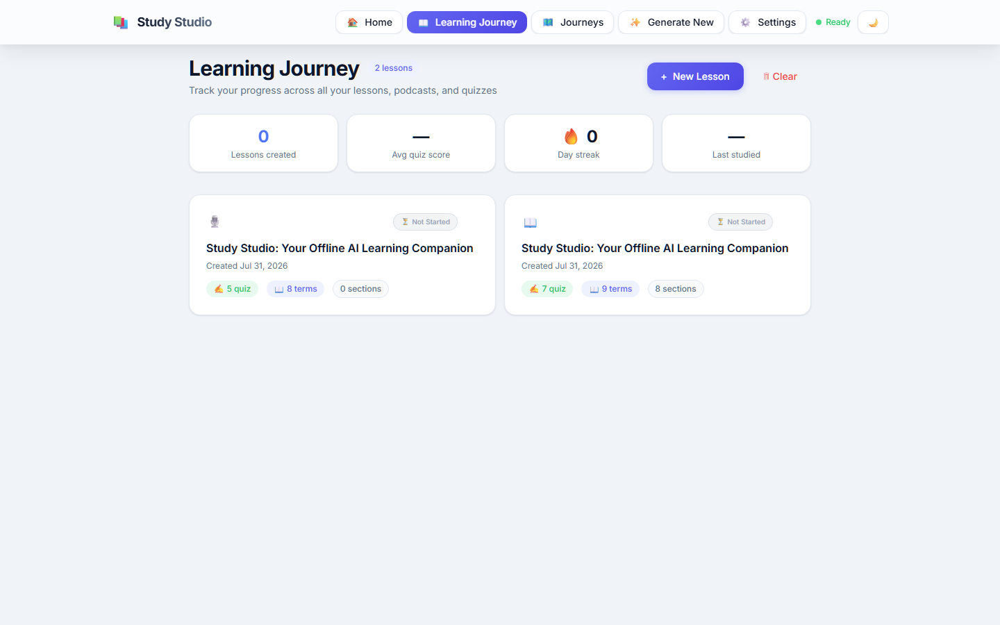
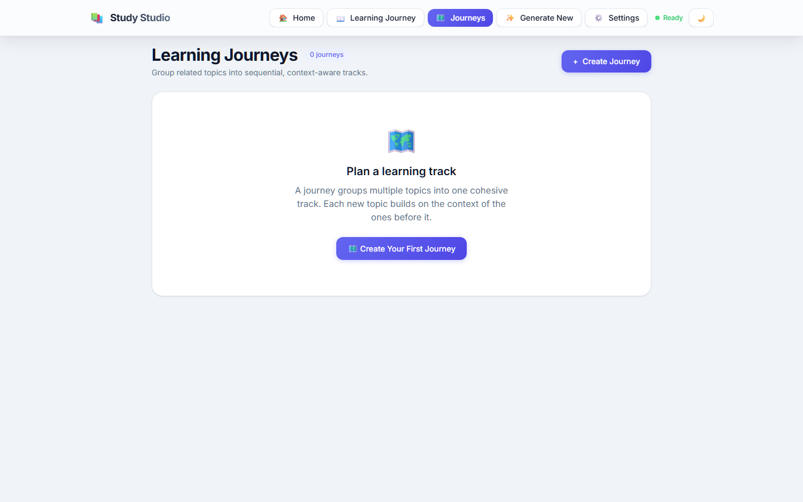
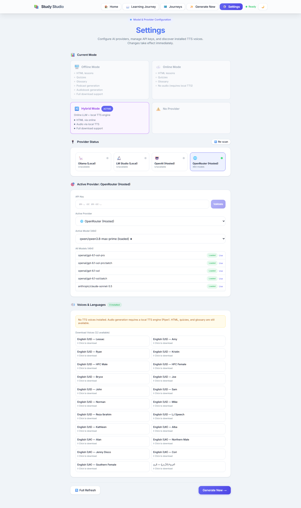
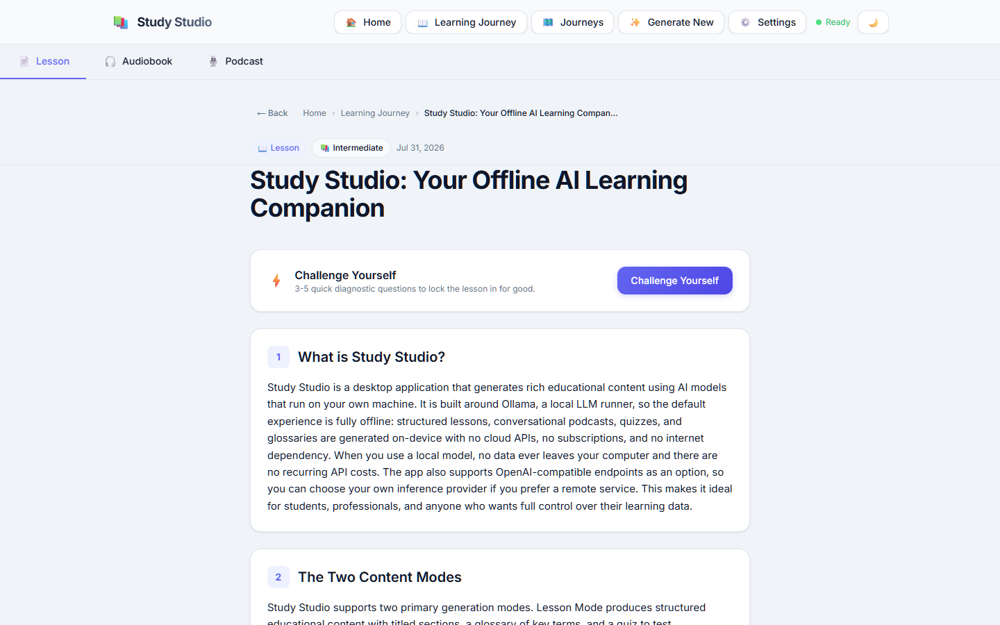
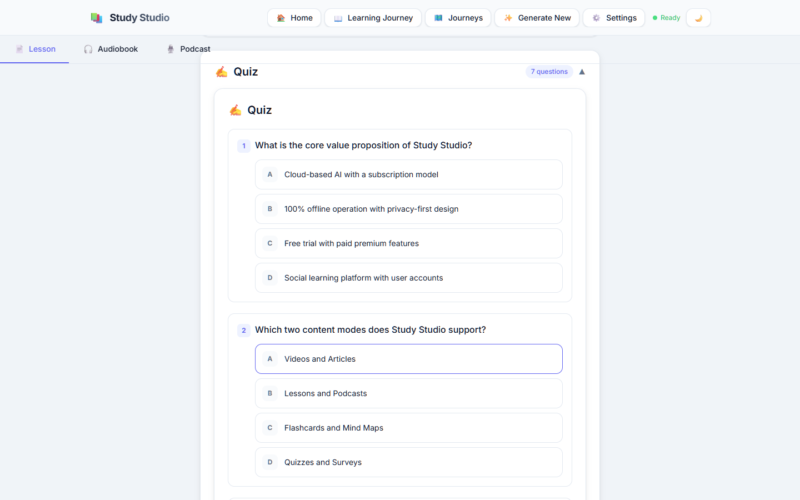

<div align="center">

# Study Studio


<!-- badges:start -->

[](https://github.com/HatemIsmailShalaby1979/Study-Studio/actions)

[](https://github.com/HatemIsmailShalaby1979/Study-Studio/commits/main)
)

*Measured 2026-10-06 — CI **success**; head `eb53cbd` (2026-10-05); TypeScript.*

<!-- No static test or coverage count is shown here: a frozen
     number decays silently. Run the suite for a current figure;
     the CI badge above is the live status. -->
<!-- badges:end -->

**A private, local-first AI tutor that runs on your machine.**

[](https://github.com/HatemIsmailShalaby1979/Study-Studio/actions/workflows/ci.yml)


</div>

## One-line identity

Study Studio is a private, local-first AI tutor that turns a topic into a lesson, a
dual-host podcast script, a glossary, and a quiz — without sending a word to the
cloud.

> [!NOTE]
> **Operating principle.** A local model is a tool the user owns, not a service that owns the user. Generation without an internet dependency is the default, not a privacy add-on: the app talks to a model runtime on the same machine, and with neither a model nor ffmpeg installed it simply tells you what is missing rather than reaching for a hosted API.

## Screenshots

Captured from the production static export (`apps/desktop/out`) served locally, in a fresh
browser profile: Library, Journeys and Settings on 2026-09-30, Lesson and Quiz on 2026-10-01.
No model runtime was running for any of them — the lesson and quiz are the app's own bundled
featured lesson, which the Library imports on first launch. No fixtures and no seeded data.

| Library | Journeys |
| --- | --- |
|  |  |

**Settings** — provider status, the active provider, and the voice catalogue:



**Lesson** — the bundled featured lesson, opened from the Library:



**Quiz** — the same lesson's quiz, expanded:



## What it does today

| Capability | Status |
| --- | --- |
| Structured lessons (sections, glossary, quiz) | Working |
| Dual-host podcast scripts (English / Arabic) | Working |
| Quiz with local scoring and optional AI evaluation | Working |
| Piper TTS → MP3/WAV export | Working when voice models **and** ffmpeg are installed |
| Multi-provider runtime (LM Studio, Ollama, OpenAI-compatible, optional OpenAI / OpenRouter) | Working |
| On-demand model load from the app (no preloading in LM Studio) | Working |
| Learning Journey (progress, streaks, quiz scores) | Working |
| Library in IndexedDB with legacy localStorage migration | Working |
| Desktop installers (NSIS / MSI / portable) | Built for Windows x64 |
| Mobile client | **Removed** — the Expo scaffold was unreachable code |
| Hosted SaaS | **Not offered** and not planned as a requirement |

## How it fits Helix Codex

Study Studio is a **component** — the product layer that turns a local model into
study material. It is an **independent repository with no shared codebase** with Helix
Prime. No data pipeline is wired between it and the core today; it is portfolio-adjacent
and technically independent.

## Architecture

- `apps/desktop` — the whole application, and the only app package: a Next.js client
  (`src/app`, `src/components`, `src/hooks`, `src/lib`) inside a Tauri 2 shell
  (`src-tauri`, Rust). The Windows installer build target. There is no `apps/web` — the
  frontend is not a separate package.
- `apps/desktop/src/lib/ai-runtime/` — provider contract, capability detection, model
  selection (the runtime the coverage gate measures).
- Library — IndexedDB with a localStorage migration path.

## Production status & test coverage

Snapshot 2026-10-02. The latest CI run on `main` is
[`36960778059`](https://github.com/HatemIsmailShalaby1979/Study-Studio/actions/runs/36960778059),
head `8b46d645731d41d762b0ba40c09cb7eb8dec1056` — a docs-only commit, so the measured
results below are unchanged from the preceding code run
[`36803605646`](https://github.com/HatemIsmailShalaby1979/Study-Studio/actions/runs/36803605646),
head `88ade450689cd377ec9d90d358787bff269d070b`; that run's job logs are the source for
the test counts, coverage, and workflow results in the table below:

| Check | Result | Source |
| --- | --- | --- |
| Test suites | 47 passed / 47 total | CI run [`36803605646`](https://github.com/HatemIsmailShalaby1979/Study-Studio/actions/runs/36803605646), 2026-10-01 |
| Tests | 986 passed / 986 total | CI run [`36803605646`](https://github.com/HatemIsmailShalaby1979/Study-Studio/actions/runs/36803605646), 2026-10-01 |
| Coverage (statements / branches) | 85.66% / 75.13% | CI run [`36803605646`](https://github.com/HatemIsmailShalaby1979/Study-Studio/actions/runs/36803605646), 2026-10-01 |
| Typecheck (`tsc --noEmit`) | Clean | CI run [`36803605646`](https://github.com/HatemIsmailShalaby1979/Study-Studio/actions/runs/36803605646), 2026-10-01 |
| Lint (`eslint src --max-warnings 0`) | Clean | CI run [`36803605646`](https://github.com/HatemIsmailShalaby1979/Study-Studio/actions/runs/36803605646), 2026-10-01 |
| Version manifests | Clean — 4 manifests agree at 0.2.0 | CI run [`36803605646`](https://github.com/HatemIsmailShalaby1979/Study-Studio/actions/runs/36803605646), 2026-10-01 |
| Design-token guard | Clean — 20 token utilities, 1 stylesheet | CI run [`36803605646`](https://github.com/HatemIsmailShalaby1979/Study-Studio/actions/runs/36803605646), 2026-10-01 |
| Static export (`next build --webpack`) | Clean — 7 routes, all prerendered | CI run [`36803605646`](https://github.com/HatemIsmailShalaby1979/Study-Studio/actions/runs/36803605646), 2026-10-01 |
| Coverage floors (`check:coverage`) | Met — `src/lib/ai-runtime/runtime.ts` at 100% lines | CI run [`36803605646`](https://github.com/HatemIsmailShalaby1979/Study-Studio/actions/runs/36803605646), 2026-10-01 |
| Mutation testing (28 targeted mutations) | 28/28 caught | CI run [`36803605646`](https://github.com/HatemIsmailShalaby1979/Study-Studio/actions/runs/36803605646), 2026-10-01 |

> [!IMPORTANT]
> **CI is green on `main`.** The latest run is
> [`36803605646`](https://github.com/HatemIsmailShalaby1979/Study-Studio/actions/runs/36803605646)
> (2026-10-01, head `88ade450689cd377ec9d90d358787bff269d070b`, branch `main`, event `push`); all four jobs passed:
> `typecheck, lint, versions`; `tests and coverage floors`; `static export and design tokens`;
> and `mutation testing`. The first fully green run on `main` was `36803350157`.
>
> The two jobs that had been red were fixed rather than muted. `Coverage floors` failed on
> `runtime.ts` at 94.63% lines against a 95% floor, and is closed with five behavioural tests
> — the floor is unchanged and no `istanbul-ignore` was added. `mutation testing` failed
> because one mutation, `validation-chunk-minimum-lines-removed`, drove its target suite into
> an await-only microtask loop that Jest's timer-based `testTimeout` cannot interrupt: the
> worker exhausted the V8 heap and died by SIGKILL, which the harness reported as a timeout.
> It was retargeted at the schema's own suite (`validation.test.ts`), where it fails fast and
> deterministically. No floor was lowered and no mutation was deleted.
>
> The 13 commits that produced this green run were promoted to `main` by a fast-forward push
> (`dbc370a..2947dfc`). The badge at the top of this file tracks `main` and now renders green.

> [!WARNING]
> Live opt-in suites exist for LM Studio and Ollama (`LMSTUDIO_LIVE=1`, `OLLAMA_LIVE=1`); without those env vars CI stays hermetic. Generation needs a local model runtime. Audio export needs Piper voice files plus ffmpeg. On a clean machine with neither, the app will not produce lessons or audio. The mobile client was removed, and a hosted SaaS is not offered. No external audit, no certified data isolation, no signed security review, no revenue.

## Run it

Verified on a clean clone on 2026-09-30: `git clone` → `npm install` → `npm run dev`
serves the app on http://localhost:3000.

### Browser (fastest)

```bash
cd apps/desktop
npm install
npm run dev
```

Open http://localhost:3000. The app sets `trailingSlash: true`, so routes resolve with a
trailing slash — `/generate/`, `/library/`, `/settings/`; the unslashed form returns a
redirect.

> [!NOTE]
> **Bundler policy: `dev` is Turbopack, `build` is webpack.** `dev` and `dev:host` pass no
> flag; `build` and `build:prod` pass `--webpack`, and that flag is not redundant —
> Turbopack's static export emits no `out/_next/static/css/`, so the design-token guard fails
> with *"no compiled stylesheet found"* (measured both ways). The Turbopack conflict that
> once forced `--webpack` everywhere was a version mismatch, not a Next limitation:
> `@next/bundle-analyzer` was pinned `^14.2.35` against Next `^16.3.6`, and 14.x injects a
> `webpack` config unconditionally, which Turbopack refuses. The analyzer is now on 16.x and
> `next dev` runs clean.

In a browser, calls to local runtimes go direct over HTTP, so those servers must allow
CORS. The desktop shell routes through Rust and does not have that constraint.

### Desktop (requires the Rust toolchain)

```bash
cd apps/desktop
npm install
npm run tauri:dev      # development
npm run tauri:build    # Windows installer
```

`npm run tauri:dev` starts the dev server through `scripts/dev-warm.mjs`, which shells out
to `npm run dev` — so it inherits the Turbopack policy above.

For local models, LM Studio (port `1234`) or Ollama (port `11434`). For audio, install
Piper voice models **and** ffmpeg.

## Related work

See the [profile README](https://github.com/HatemIsmailShalaby1979) for how this project
fits the wider work.

## Author

Built by Hatem Ismail Shalaby, Contact Centre Operations & AI Implementation Lead | WFM & CX Transformation. Background: https://github.com/HatemIsmailShalaby1979

## Licence

MIT
